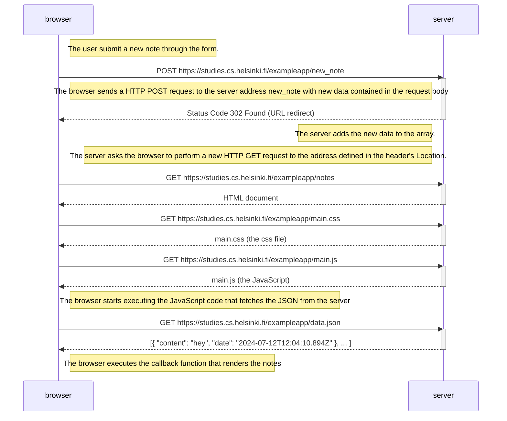

```mermaid
sequenceDiagram
    participant browser
    participant server

    Note right of browser: The user submit a new note through the form.

    browser->>server: POST https://studies.cs.helsinki.fi/exampleapp/new_note
    activate server

    Note right of browser: The browser sends a HTTP POST request to the server address new_note with new data contained in the request body

    server-->>browser: Status Code 302 Found (URL redirect)
    deactivate server

    Note left of server: The server adds the new data to the array.
    Note left of server: The server asks the browser to perform a new HTTP GET request to the address defined in the header's Location.

    browser->>server: GET https://studies.cs.helsinki.fi/exampleapp/notes
    activate server
    server-->>browser: HTML document
    deactivate server

    browser->>server: GET https://studies.cs.helsinki.fi/exampleapp/main.css
    activate server
    server-->>browser: main.css (the css file)
    deactivate server

    browser->>server: GET https://studies.cs.helsinki.fi/exampleapp/main.js
    activate server
    server-->>browser: main.js (the JavaScript)
    deactivate server

    Note right of browser: The browser starts executing the JavaScript code that fetches the JSON from the server

    browser->>server: GET https://studies.cs.helsinki.fi/exampleapp/data.json
    activate server
    server-->>browser: [{ "content": "hey", "date": "2024-07-12T12:04:10.894Z" }, ... ]
    deactivate server

    Note right of browser: The browser executes the callback function that renders the notes
```
