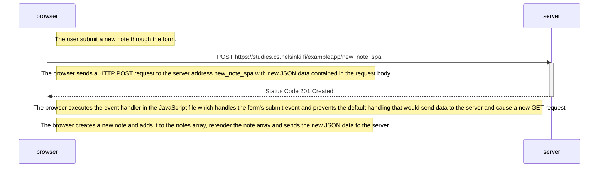

```mermaid
sequenceDiagram
    participant browser
    participant server

    Note right of browser: The user submit a new note through the form.

    browser->>server: POST https://studies.cs.helsinki.fi/exampleapp/new_note_spa
    activate server

    Note right of browser: The browser sends a HTTP POST request to the server address new_note_spa with new JSON data contained in the request body

    server-->>browser: Status Code 201 Created 
    deactivate server

    Note right of browser: The browser executes the event handler in the JavaScript file which handles the form's submit event and prevents the default handling that would send data to the server and cause a new GET request
     
    Note right of browser: The browser creates a new note and adds it to the notes array, rerender the note array and sends the new JSON data to the server
```
